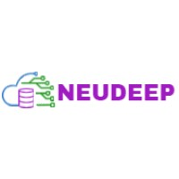

# Label Generator Application



## Overview

Welcome to the Label Generator Application, a user-friendly tool designed for crafting Zebra Programming Language (ZPL) labels effortlessly. This innovative application seamlessly blends the versatility of [JavaScript/ReactJS (FabricJS)] with the robustness of Python/Flask to provide a seamless label designing experience with following features:

## Features

- **Feature 1:** You can add text/labels.
- **Feature 2:** You can change font size,style and weight
- **Feature 3:** You can Use diffrenet shapes,lines.
- **Feature 4:** You can change the label page size with required width and height along with units like mm, cm, inch.
- **Feature 5:** You can save your label as json and zpl file
- **Feature 6:** You can add Barcode , QRcode , company logo/Image
- **Feature 7:** You can retrive the saved label drawing by opening the json file of label back on canvas in the editable drawing format.

## Screenshots


>))

>))

>))

>))

>))

>))

>))

>))

>))

>))

>))

>))

>))

>))

>))


>))


## Installation

1. Clone the repository:

```
   git clone https://github.com/neudeeptech/Zpl-Label-Generator

```

## Usage

# start frontend server

``` 
cd frontend
npm install 
npm start 
```

# start backend server
``` 
cd backend
sudo apt-get install python3-dev
sudo apt install python3-venv
python3 -m venv venv
pip3 install -r requirements.txt 
python3 app.py
```
# if dont want to use virtual env for python backend server:
```
cd backend
pip3 install -r requirements.txt
python3 app.py
```
## License
This project is licensed under the [GPL-3.0 license] - see the LICENSE.md file for details.

## Acknowledgments
Thanks to our neudeep technologies amazing team of developers. 

## Contact
If you have any questions or suggestions, feel free to contact us at [bhagwat.masalkar@neudeep.com].
